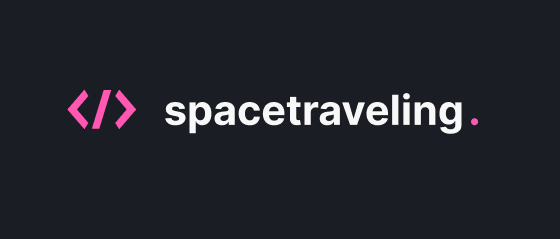
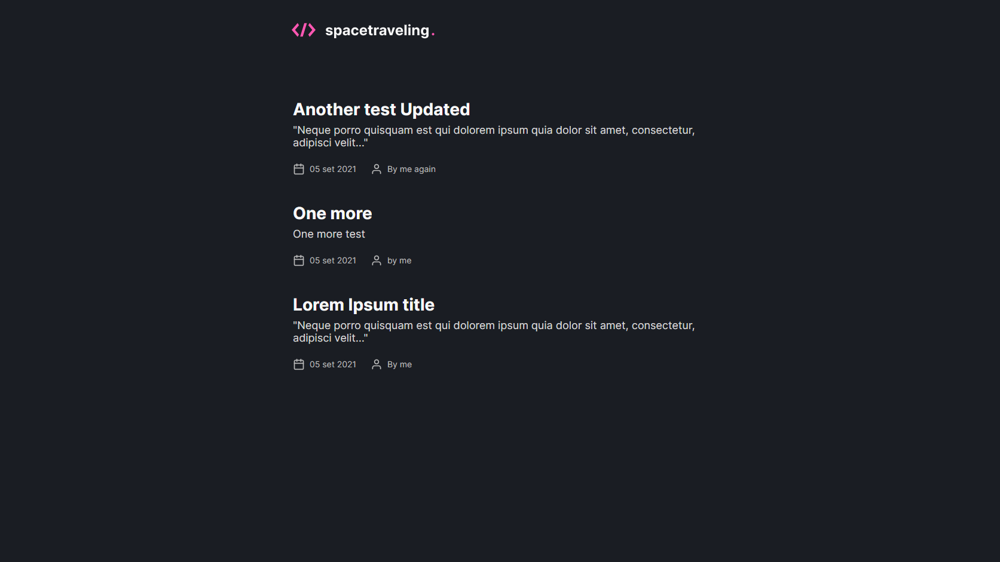
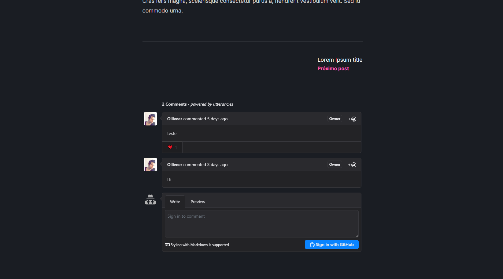
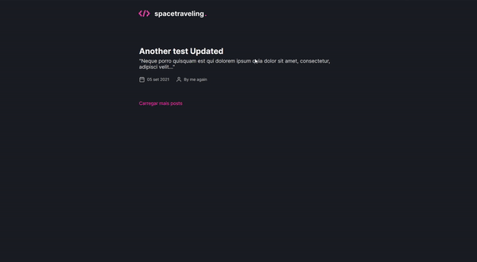

<h1 align="center">
  
</h1>

## 📌 Index

- [About](#-sobre-o-projeto)
- [Screenshots](#-screenshots)
- [Techs](#-techs)

## ❔ About

NextJs SSG blog with Primisc

## 📸 Screenshots

<h1 align="center">
  
</h1>

<h1 align="center">
  
</h1>

<h1 align="center">
  
</h1>

## 🛠 Techs

This project was developed using the following technologies:

- [TypeScript](https://www.typescriptlang.org/)
- [React](https://pt-br.reactjs.org/)
- [NextJs](https://nextjs.org/)
- [utteranc](https://utteranc.es/)
- [Prismic](https://prismic.io/)

---

